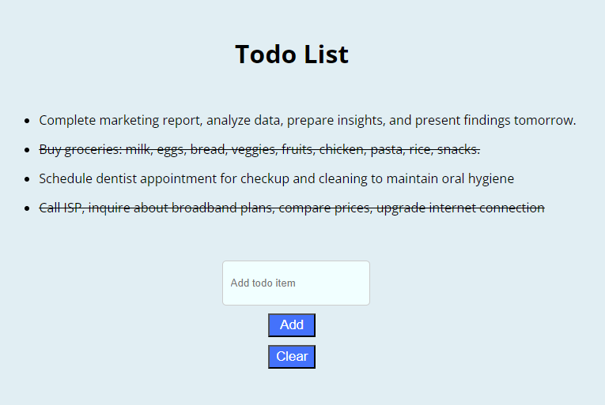

# React TypeScript Todo

This repository hosts a TodoList app developed using React and TypeScript. The project aims to enhance React and TypeScript skills by implementing a robust task management tool. By leveraging React's UI capabilities and TypeScript's type safety, this app provides an efficient solution for organizing tasks.

## Features

- **Task Management**: Add, Clear tasks.
- **Type Safety**: Utilizes TypeScript for ensuring type safety and reducing errors.
- **Responsive Design**: Provides a seamless experience across various devices and screen sizes.
- **Intuitive Interface**: Simple and user-friendly interface for easy task management.
